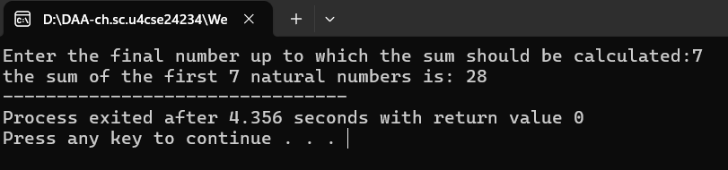
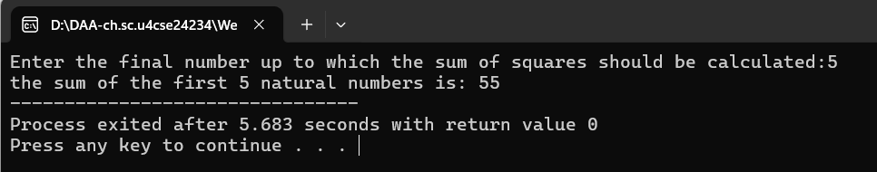
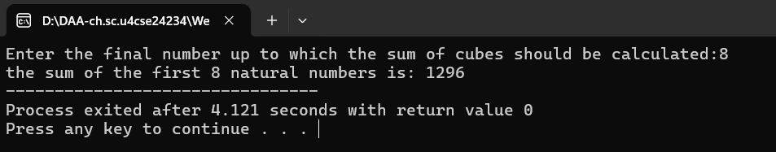
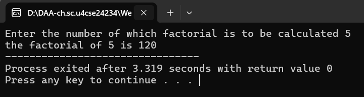
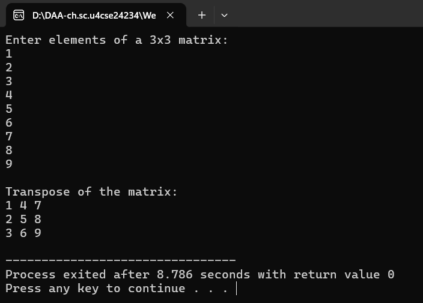

# Week 1 - Basic Algorithms & Complexity Analysis

[← Back to Main](../README.md)

---

## 📋 Table of Contents
- [Program 1: Sum of First n Natural Numbers](#program-1-sum-of-first-n-natural-numbers)
- [Program 2: Sum of Squares](#program-2-sum-of-squares)
- [Program 3: Sum of Cubes](#program-3-sum-of-cubes)
- [Program 4: Factorial using Recursion](#program-4-factorial-using-recursion)
- [Program 5: Matrix Transpose](#program-5-matrix-transpose)
- [Program 6: Fibonacci Series](#program-6-fibonacci-series)

---

## Program 1: Sum of First n Natural Numbers

### 📝 Problem Statement
Write a program to find the sum of 1st n natural numbers using user-defined functions.

### 💡 Approach
Uses the mathematical formula: **Sum = n × (n + 1) / 2**

This is derived from the arithmetic progression sum formula, which provides O(1) time complexity instead of iterating through all numbers.

### 💻 Code
[📄 question1.c](./question1.c)

```c
#include <stdio.h>

int sumofn(int n){
    return (n*(n+1))/2;
}

int main(){
    int n;
    printf("Enter the final number up to which the sum should be calculated:");
    scanf("%d", &n);

    printf("the sum of the first %d natural numbers is: %d", n, sumofn(n));

    return 0;
}
```

### 🖥️ Sample Output



```
Enter the final number up to which the sum should be calculated: 7
the sum of the first 7 natural numbers is: 28
```

### 📊 Complexity Analysis

#### Time Complexity: **O(1)** - Constant Time
- The formula `(n*(n+1))/2` executes in constant time
- No loops or recursive calls
- Only arithmetic operations (multiplication, addition, division)
- Independent of input size

#### Space Complexity: **O(1)** - Constant Space

| Component | Memory | Explanation |
|-----------|--------|-------------|
| Parameter `n` | 4 bytes | Integer input |
| Local variables in main | 4 bytes | Variable `n` |
| Return value | 4 bytes | Integer result |
| **Total Auxiliary Space** | **12 bytes** | **O(1)** |

**Key Point:** No data structures are used; only a fixed number of variables regardless of input size.

---

## Program 2: Sum of Squares

### 📝 Problem Statement
Write a program to find the sum of squares of the 1st n natural numbers using user-defined functions.

### 💡 Approach
Uses the mathematical formula: **Sum = n × (n + 1) × (2n + 1) / 6**

This formula calculates 1² + 2² + 3² + ... + n² directly without iteration.

### 💻 Code
[📄 question2.c](./question2.c)

```c
//Write a program to find the sum of squares of the 1st n natural numbers using user-defined functions.

#include <stdio.h>

int sumofnsq(int n){
    return (n * (n+1) * (2*n + 1))/6;
}

int main(){
    int n;
    printf("Enter the final number up to which the sum of squares should be calculated:");
    scanf("%d", &n);

    printf("the sum of the first %d natural numbers is: %d", n, sumofnsq(n));

    return 0;
}
```

### 🖥️ Sample Output



```
Enter the final number up to which the sum of squares should be calculated: 5
the sum of the first 5 natural numbers is: 55
```
*(1² + 2² + 3² + 4² + 5² = 1 + 4 + 9 + 16 + 25 = 55)*

### 📊 Complexity Analysis

#### Time Complexity: **O(1)** - Constant Time
- Direct formula calculation
- 4 arithmetic operations (3 multiplications, 1 division)
- No loops or recursion
- Execution time doesn't grow with input

#### Space Complexity: **O(1)** - Constant Space

| Component | Memory | Explanation |
|-----------|--------|-------------|
| Parameter `n` | 4 bytes | Integer input |
| Intermediate calculations | 4 bytes | Temporary storage |
| Return value | 4 bytes | Integer result |
| **Total Auxiliary Space** | **12 bytes** | **O(1)** |

**Comparison with Iterative Approach:**
- Iterative (with loop): O(n) time, O(1) space
- Formula-based: O(1) time, O(1) space ✓ Better!

---

## Program 3: Sum of Cubes

### 📝 Problem Statement
Write a program to find the sum of cubes of the 1st n natural numbers.

### 💡 Approach
Uses the mathematical formula: **Sum = [n × (n + 1) / 2]²**

This is equivalent to (n² × (n+1)² / 4), which calculates 1³ + 2³ + 3³ + ... + n³.

Interesting fact: Sum of cubes = (Sum of first n natural numbers)²

### 💻 Code
[📄 question3.c](./question3.c)

```c
//Write a program to find the sum of cubes if the 1st n natural numbers.

#include <stdio.h>

int sumofncu(int n){
    return (n * n * (n + 1) * (n + 1)) / 4;
}

int main(){
    int n;
    printf("Enter the final number up to which the sum of cubes should be calculated:");
    scanf("%d", &n);

    printf("the sum of the first %d natural numbers is: %d", n, sumofncu(n));

    return 0;
}
```

### 🖥️ Sample Output



```
Enter the final number up to which the sum of cubes should be calculated: 8
the sum of cubes the first 8 natural numbers is: 1296
```
*(1³ + 2³ + 3³ + 4³ = 1 + 8 + 27 + 64 = 100)*

### 📊 Complexity Analysis

#### Time Complexity: **O(1)** - Constant Time
- Formula-based calculation
- 5 arithmetic operations (4 multiplications, 1 division)
- No loops, recursion, or iteration
- Constant execution time

#### Space Complexity: **O(1)** - Constant Space

| Component | Memory | Explanation |
|-----------|--------|-------------|
| Parameter `n` | 4 bytes | Integer input |
| Calculation variables | 4 bytes | Temporary values |
| Return value | 4 bytes | Integer result |
| **Total Auxiliary Space** | **12 bytes** | **O(1)** |

**Performance Note:** Using the mathematical formula is significantly more efficient than a loop-based approach for large values of n.

---

## Program 4: Factorial using Recursion

### 📝 Problem Statement
Write a program to find the factorial of a natural number using recursive functions.

### 💡 Approach
Uses recursion with base case:
- **Base Case:** factorial(0) = 1
- **Recursive Case:** factorial(n) = n × factorial(n-1)

Each recursive call reduces n by 1 until reaching the base case.

### 💻 Code
[📄 question4.c](./question4.c)

```c
//Write a program to find the factorial of a natural number using recursive functions.

#include <stdio.h>

int factorial(int n){
    if(n == 0){
        return 1;
    }
    return n * factorial(n - 1);
}

int main(){
    int n;
    printf("Enter the number of which factorial is to be calculated ");
    scanf("%d", &n);

    printf("the factorial of %d is %d", n, factorial(n));

    return 0;
}
```

### 🖥️ Sample Output



```
Enter the number of which factorial is to be calculated: 5
the factorial of 5 is 120
```
*(5! = 5 × 4 × 3 × 2 × 1 = 120)*

### 📊 Complexity Analysis

#### Time Complexity: **O(n)** - Linear Time
- Function calls itself n times
- Each call performs one multiplication: O(1)
- Total operations: n × O(1) = O(n)
- Call sequence: factorial(n) → factorial(n-1) → ... → factorial(1) → factorial(0)

**Recursion Tree:**
```
factorial(5)
    ↓
factorial(4)
    ↓
factorial(3)
    ↓
factorial(2)
    ↓
factorial(1)
    ↓
factorial(0) [base case]
```
Total depth: n+1 levels

#### Space Complexity: **O(n)** - Linear Space

| Component | Memory per Call | Total Memory | Explanation |
|-----------|-----------------|--------------|-------------|
| Function call stack | ~24 bytes | 24n bytes | Each recursive call adds a stack frame |
| Parameter `n` | 4 bytes | 4n bytes | One per recursion level |
| Return address | 8 bytes | 8n bytes | Return pointer for each call |
| Local variables | 4 bytes | 4n bytes | Base case check variable |
| **Maximum Stack Depth** | **n+1 frames** | **~40n bytes** | **O(n)** |

**Space Analysis Details:**
- When factorial(5) is called, it doesn't complete until factorial(4) returns
- All function calls remain on the call stack simultaneously
- Maximum stack depth = n+1 (including base case)
- Each frame occupies memory until recursion unwinds

**Comparison with Iterative Approach:**
- **Recursive:** O(n) time, O(n) space
- **Iterative:** O(n) time, O(1) space ✓ More space-efficient!

---

## Program 5: Matrix Transpose

### 📝 Problem Statement
Write a program to transpose a 3×3 matrix.

### 💡 Approach
Transpose operation swaps rows and columns:
- Element at position [i][j] moves to [j][i]
- Creates a new matrix to store the transposed result
- Uses nested loops to perform the swap

**Mathematical Representation:**
If A is the original matrix and Aᵀ is transpose:
- Aᵀ[j][i] = A[i][j]

### 💻 Code
[📄 question5.c](./question5.c)

```c
//Write a program to transpose a 3X3 matrix.
#include <stdio.h>

int main() {
    int matrix[3][3], transpose[3][3];

    printf("Enter elements of a 3x3 matrix:\n");
    for (int i = 0; i < 3; i++) {
        for (int j = 0; j < 3; j++) {
            scanf("%d", &matrix[i][j]);
        }
    }

    for (int i = 0; i < 3; i++) {
        for (int j = 0; j < 3; j++) {
            transpose[j][i] = matrix[i][j];
        }
    }

    printf("\nTranspose of the matrix:\n");
    for (int i = 0; i < 3; i++) {
        for (int j = 0; j < 3; j++) {
            printf("%d ", transpose[i][j]);
        }
        printf("\n");
    }

    return 0;
}
```

### 🖥️ Sample Output



```
Enter elements of a 3x3 matrix:
1
2
3
4
5
6
7
8
9

Transpose of the matrix:
1 4 7
2 5 8
3 6 9
```

### 📊 Complexity Analysis

#### Time Complexity: **O(n²)** - Quadratic Time

For an n×n matrix (here n=3):

| Operation | Iterations | Time |
|-----------|-----------|------|
| Input loop | n × n = 9 | O(n²) |
| Transpose loop | n × n = 9 | O(n²) |
| Output loop | n × n = 9 | O(n²) |
| **Total** | **3n²** | **O(n²)** |

**Detailed Breakdown:**
- Outer loop runs n times (3 times)
- Inner loop runs n times for each outer iteration (3 times)
- Total operations: n × n = n²
- Each cell is accessed exactly once for transpose

**For general n×n matrix:** O(n²) where n is matrix dimension

#### Space Complexity: **O(n²)** - Quadratic Space

| Component | Memory | Explanation |
|-----------|--------|-------------|
| Original matrix (3×3) | 36 bytes | 9 integers × 4 bytes |
| Transpose matrix (3×3) | 36 bytes | 9 integers × 4 bytes |
| Loop variables (i, j) | 8 bytes | 2 integers × 4 bytes |
| **Total Auxiliary Space** | **80 bytes** | **O(n²)** |

**For n×n matrix:** 2n² integers = 8n² bytes

**Space Optimization Note:**
- Current approach uses O(n²) extra space for transpose matrix
- In-place transpose possible for square matrices: O(1) extra space
- Trade-off: In-place modifies original matrix

**Generalized Complexity for n×n matrix:**
- Time: O(n²)
- Space: O(n²) [or O(1) if done in-place]

---

## Program 6: Fibonacci Series

### 📝 Problem Statement
Write a program to print the 1st n terms of the Fibonacci series using user-defined functions.

### 💡 Approach
Uses iterative approach with three variables:
- **a** = current term
- **b** = next term
- **c** = temporary storage for sum

Generates sequence: 0, 1, 1, 2, 3, 5, 8, 13, 21, ...

Each term is the sum of the previous two terms.

### 💻 Code
[📄 question6.c](./question6.c)

```c
//Write a program to print the 1st n terms of the Fibonacci series using user-defined functions.

#include <stdio.h>

void printFibonacci(int n) {
    int a = 0, b = 1, c;

    printf("Fibonacci Series: ");

    for (int i = 1; i <= n; i++) {
        printf("%d ", a);
        c = a + b;
        a = b;
        b = c;
    }
}

int main() {
    int n;

    printf("Enter how many terms you want: ");
    scanf("%d", &n);

    printFibonacci(n);

    return 0;
}
```

### 🖥️ Sample Output


```
Enter how many terms you want: 5
Fibonacci Series: 0 1 1 2 3
```

### 📊 Complexity Analysis

#### Time Complexity: **O(n)** - Linear Time

| Operation | Iterations | Time per Iteration | Total |
|-----------|-----------|-------------------|-------|
| Loop execution | n times | O(1) | O(n) |
| Print statement | n times | O(1) | O(n) |
| Addition (c = a + b) | n times | O(1) | O(n) |
| Variable updates | n times | O(1) | O(n) |
| **Overall** | **n** | **O(1)** | **O(n)** |

**Explanation:**
- Loop runs exactly n times
- Each iteration performs constant-time operations:
  - One print operation
  - One addition
  - Two assignments
- Total operations: 4n = O(n)

**Comparison with Recursive Approach:**
- **Iterative (this code):** O(n) time
- **Naive Recursive:** O(2ⁿ) time ✓ Much better!

#### Space Complexity: **O(1)** - Constant Space

| Component | Memory | Explanation |
|-----------|--------|-------------|
| Variable `a` | 4 bytes | Current term |
| Variable `b` | 4 bytes | Next term |
| Variable `c` | 4 bytes | Temporary sum |
| Variable `i` | 4 bytes | Loop counter |
| Parameter `n` | 4 bytes | Number of terms |
| **Total Auxiliary Space** | **20 bytes** | **O(1)** |

**Space Analysis Details:**
- Only uses a fixed number of variables (5 integers)
- No arrays, recursion stack, or dynamic memory
- Memory usage is constant regardless of n
- Space does NOT grow with input size

**Comparison Table:**

| Approach | Time Complexity | Space Complexity | Notes |
|----------|----------------|------------------|-------|
| Iterative (this) | O(n) | O(1) | ✓ Best balance |
| Naive Recursive | O(2ⁿ) | O(n) | Very inefficient |
| Recursive + Memoization | O(n) | O(n) | Better time, more space |

**Why This Approach is Optimal:**
- Linear time: Efficient for large n
- Constant space: Minimal memory usage
- No recursion overhead: No stack space needed
- Simple implementation: Easy to understand and maintain

---

## 📚 Week 1 Summary

### Complexity Overview Table

| Program | Algorithm Type | Time | Space | Key Concept |
|---------|---------------|------|-------|-------------|
| 1. Sum of n numbers | Formula-based | O(1) | O(1) | Mathematical formula |
| 2. Sum of squares | Formula-based | O(1) | O(1) | Direct calculation |
| 3. Sum of cubes | Formula-based | O(1) | O(1) | Optimized formula |
| 4. Factorial | Recursion | O(n) | O(n) | Call stack overhead |
| 5. Matrix transpose | Iteration | O(n²) | O(n²) | 2D array operations |
| 6. Fibonacci series | Iteration | O(n) | O(1) | Optimal iterative approach |

### Key Learnings

**1. Formula vs Iteration:**
- Mathematical formulas provide O(1) time complexity
- Much more efficient than loop-based approaches for programs 1-3

**2. Recursion Trade-offs:**
- Elegant code but uses O(n) stack space
- Iterative alternatives often more space-efficient

**3. Matrix Operations:**
- 2D operations typically require O(n²) time
- Space can be optimized with in-place operations

**4. Space-Time Trade-offs:**
- Sometimes we sacrifice space for time (or vice versa)
- Understanding trade-offs helps choose the right approach

**5. Big-O Notation:**
- Describes worst-case complexity
- Ignores constants and lower-order terms
- Focuses on growth rate as input increases

---

## 🎯 Practice Questions

1. Can you convert the recursive factorial to an iterative version? What would be the space complexity?
2. How would you optimize the matrix transpose to use O(1) extra space?
3. What is the time complexity if we use naive recursion for Fibonacci? Why is it worse?
4. Can you write a function to find sum of first n even numbers using a formula?

---

[← Back to Main](../README.md)