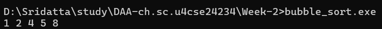
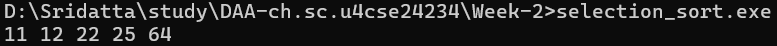
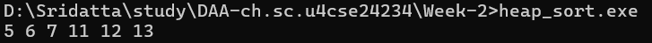
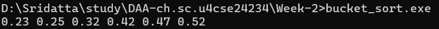

# Week 2 - Sorting Algorithms

[← Back to Main](../README.md)

---

## 📋 Table of Contents
- [Program 1: Bubble Sort](#program-1-bubble-sort)
- [Program 2: Selection Sort](#program-2-selection-sort)
- [Program 3: Insertion Sort](#program-3-insertion-sort)
- [Program 4: Heap Sort](#program-4-heap-sort)
- [Program 5: Bucket Sort](#program-5-bucket-sort)

---

## Program 1: Bubble Sort

### 📝 Problem Statement
Implement Bubble Sort algorithm to sort an array of integers in ascending order.

### 💡 Approach
Bubble Sort repeatedly steps through the array, compares adjacent elements, and swaps them if they're in the wrong order. The largest element "bubbles up" to its correct position in each pass.

**Algorithm:**
1. Compare adjacent elements
2. Swap if they're in wrong order
3. Repeat for all elements
4. After each pass, the largest unsorted element reaches its final position

### 💻 Code
[📄 bubble_sort.c](./bubble_sort.c)

```c
#include <stdio.h>

void bubbleSort(int a[], int n) {
    for (int i = 0; i < n - 1; i++) {
        for (int j = 0; j < n - i - 1; j++) {
            if (a[j] > a[j + 1]) {
                int temp = a[j];
                a[j] = a[j + 1];
                a[j + 1] = temp;
            }
        }
    }
}

void printArray(int a[], int n) {
    for (int i = 0; i < n; i++) printf("%d ", a[i]);
}

int main() {
    int arr[] = {5, 1, 4, 2, 8};
    int n = sizeof(arr)/sizeof(arr[0]);

    bubbleSort(arr, n);
    printArray(arr, n);
}
```

### 🖥️ Sample Output



```
1 2 4 5 8
```

**Working Example:**
```
Initial: [5, 1, 4, 2, 8]
Pass 1:  [1, 4, 2, 5, 8]  → 8 bubbles to end
Pass 2:  [1, 2, 4, 5, 8]  → 5 in position
Pass 3:  [1, 2, 4, 5, 8]  → 4 in position
Pass 4:  [1, 2, 4, 5, 8]  → Sorted!
```

### 📊 Complexity Analysis

#### Time Complexity

| Case | Complexity | Condition | Explanation |
|------|-----------|-----------|-------------|
| **Best Case** | **O(n)** | Already sorted | With optimization, one pass needed |
| **Average Case** | **O(n²)** | Random order | Roughly n²/2 comparisons |
| **Worst Case** | **O(n²)** | Reverse sorted | Maximum swaps needed |

**Detailed Analysis:**
- Outer loop runs: n-1 times
- Inner loop runs: (n-1), (n-2), ..., 1 times
- Total comparisons: (n-1) + (n-2) + ... + 1 = n(n-1)/2 = O(n²)
- Number of swaps (worst case): Same as comparisons = O(n²)

**Pass-by-Pass Breakdown:**
```
Pass 1: n-1 comparisons
Pass 2: n-2 comparisons
Pass 3: n-3 comparisons
...
Pass n-1: 1 comparison
Total: (n-1) + (n-2) + ... + 1 = n(n-1)/2
```

#### Space Complexity: **O(1)** - Constant Space

| Component | Memory | Explanation |
|-----------|--------|-------------|
| Array (input) | 4n bytes | Original array (not counted as auxiliary) |
| Variable `i` | 4 bytes | Outer loop counter |
| Variable `j` | 4 bytes | Inner loop counter |
| Variable `temp` | 4 bytes | Temporary swap variable |
| **Auxiliary Space** | **12 bytes** | **O(1)** |

**Space Analysis:**
- In-place sorting algorithm
- Only uses a constant amount of extra space
- No additional arrays or recursion stack needed

**Key Properties:**
- ✅ Stable: Maintains relative order of equal elements
- ✅ In-place: Requires O(1) extra space
- ✅ Adaptive: Can be optimized for nearly sorted arrays
- ❌ Inefficient for large datasets

---

## Program 2: Selection Sort

### 📝 Problem Statement
Implement Selection Sort algorithm to sort an array of integers in ascending order.

### 💡 Approach
Selection Sort divides the array into sorted and unsorted portions. It repeatedly finds the minimum element from the unsorted portion and places it at the beginning.

**Algorithm:**
1. Find the minimum element in unsorted portion
2. Swap it with the first unsorted element
3. Move the boundary of sorted portion forward
4. Repeat until entire array is sorted

### 💻 Code
[📄 selection_sort.c](./selection_sort.c)

```c
#include <stdio.h>

void selectionSort(int a[], int n) {
    for (int i = 0; i < n - 1; i++) {
        int minIndex = i;

        for (int j = i + 1; j < n; j++) {
            if (a[j] < a[minIndex])
                minIndex = j;
        }

        int temp = a[i];
        a[i] = a[minIndex];
        a[minIndex] = temp;
    }
}

void printArray(int a[], int n) {
    for (int i = 0; i < n; i++) printf("%d ", a[i]);
}

int main() {
    int arr[] = {64, 25, 12, 22, 11};
    int n = sizeof(arr)/sizeof(arr[0]);

    selectionSort(arr, n);
    printArray(arr, n);
}
```

### 🖥️ Sample Output



```
11 12 22 25 64
```

**Working Example:**
```
Initial: [64, 25, 12, 22, 11]
         | sorted | unsorted
Step 1:  [11, | 25, 12, 22, 64]  → min=11, swap with 64
Step 2:  [11, 12, | 25, 22, 64]  → min=12, swap with 25
Step 3:  [11, 12, 22, | 25, 64]  → min=22, swap with 25
Step 4:  [11, 12, 22, 25, | 64]  → min=25, no swap
Result:  [11, 12, 22, 25, 64]
```

### 📊 Complexity Analysis

#### Time Complexity

| Case | Complexity | Condition | Explanation |
|------|-----------|-----------|-------------|
| **Best Case** | **O(n²)** | Already sorted | Still needs to find minimum |
| **Average Case** | **O(n²)** | Random order | Same number of comparisons |
| **Worst Case** | **O(n²)** | Reverse sorted | Same number of comparisons |

**Detailed Analysis:**
- Number of comparisons is constant regardless of input
- Outer loop: n-1 iterations
- Inner loop: (n-1), (n-2), ..., 1 iterations
- Total comparisons: n(n-1)/2 = O(n²)
- Number of swaps: Maximum n-1 (one per pass)

**Comparison Count:**
```
i=0: (n-1) comparisons
i=1: (n-2) comparisons
i=2: (n-3) comparisons
...
i=n-2: 1 comparison
Total: (n-1) + (n-2) + ... + 1 = n(n-1)/2
```

#### Space Complexity: **O(1)** - Constant Space

| Component | Memory | Explanation |
|-----------|--------|-------------|
| Array (input) | 4n bytes | Original array |
| Variable `i` | 4 bytes | Outer loop counter |
| Variable `j` | 4 bytes | Inner loop counter |
| Variable `minIndex` | 4 bytes | Index of minimum element |
| Variable `temp` | 4 bytes | Temporary swap variable |
| **Auxiliary Space** | **16 bytes** | **O(1)** |

**Key Properties:**
- ❌ Unstable: May change relative order of equal elements
- ✅ In-place: Requires O(1) extra space
- ❌ Not adaptive: Always performs n² comparisons
- ✅ Minimum swaps: At most n-1 swaps (good for expensive writes)

**Advantage over Bubble Sort:**
- Fewer swaps: O(n) vs O(n²)
- Better when write operations are expensive

---

## Program 3: Insertion Sort

### 📝 Problem Statement
Implement Insertion Sort algorithm to sort an array of integers in ascending order.

### 💡 Approach
Insertion Sort builds the final sorted array one element at a time. It picks elements from the unsorted portion and inserts them into their correct position in the sorted portion.

**Algorithm:**
1. Start with second element (first is considered sorted)
2. Compare with elements in sorted portion
3. Shift larger elements to the right
4. Insert element in correct position
5. Repeat for all elements

**Similar to:** Sorting playing cards in hand

### 💻 Code
[📄 insertion_sort.c](./insertion_sort.c)

```c
#include <stdio.h>

void insertionSort(int a[], int n) {
    for (int i = 1; i < n; i++) {
        int key = a[i];
        int j = i - 1;

        // Move elements greater than key one position ahead
        while (j >= 0 && a[j] > key) {
            a[j + 1] = a[j];
            j--;
        }
        a[j + 1] = key;
    }
}

void printArray(int a[], int n) {
    for (int i = 0; i < n; i++) printf("%d ", a[i]);
}

int main() {
    int arr[] = {5, 2, 9, 1, 5, 6};
    int n = sizeof(arr)/sizeof(arr[0]);

    insertionSort(arr, n);
    printArray(arr, n);
}
```

### 🖥️ Sample Output


```
1 2 5 5 6 9
```

**Working Example:**
```
Initial: [5, 2, 9, 1, 5, 6]

Step 1: key=2  [2, 5, 9, 1, 5, 6]  → Insert 2 before 5
Step 2: key=9  [2, 5, 9, 1, 5, 6]  → 9 stays in place
Step 3: key=1  [1, 2, 5, 9, 5, 6]  → Insert 1 at start
Step 4: key=5  [1, 2, 5, 5, 9, 6]  → Insert 5 before 9
Step 5: key=6  [1, 2, 5, 5, 6, 9]  → Insert 6 before 9
```

### 📊 Complexity Analysis

#### Time Complexity

| Case | Complexity | Condition | Explanation |
|------|-----------|-----------|-------------|
| **Best Case** | **O(n)** | Already sorted | Only one comparison per element |
| **Average Case** | **O(n²)** | Random order | On average n²/4 comparisons |
| **Worst Case** | **O(n²)** | Reverse sorted | Maximum shifts needed |

**Detailed Analysis:**

**Best Case (Sorted Array):**
- Each element compared once with previous
- Total comparisons: n-1 = O(n)
- No shifts needed

**Worst Case (Reverse Sorted):**
- Element at position i requires i comparisons and shifts
- Total: 1 + 2 + 3 + ... + (n-1) = n(n-1)/2 = O(n²)

**Average Case:**
- On average, each element is compared with half of sorted portion
- Total: n²/4 ≈ O(n²)

#### Space Complexity: **O(1)** - Constant Space

| Component | Memory | Explanation |
|-----------|--------|-------------|
| Array (input) | 4n bytes | Original array |
| Variable `i` | 4 bytes | Loop counter |
| Variable `j` | 4 bytes | Position tracker |
| Variable `key` | 4 bytes | Element to insert |
| **Auxiliary Space** | **12 bytes** | **O(1)** |

**Key Properties:**
- ✅ Stable: Maintains relative order of equal elements
- ✅ In-place: Requires O(1) extra space
- ✅ Adaptive: Efficient for nearly sorted data (O(n))
- ✅ Online: Can sort data as it's received

**Best Use Cases:**
- Small datasets (< 50 elements)
- Nearly sorted data
- Real-time data streams
- When stability is required

---

## Program 4: Heap Sort

### 📝 Problem Statement
Implement Heap Sort algorithm using max-heap data structure to sort an array in ascending order.

### 💡 Approach
Heap Sort uses a binary heap data structure. It first builds a max-heap, then repeatedly extracts the maximum element and rebuilds the heap.

**Algorithm:**
1. Build a max-heap from input array
2. Swap root (maximum) with last element
3. Reduce heap size by 1
4. Heapify root to maintain max-heap property
5. Repeat steps 2-4 until heap size is 1

**Heap Property:**
- Max-Heap: Parent ≥ Children
- For index i: Left child = 2i+1, Right child = 2i+2

### 💻 Code
[📄 heap_sort.c](./heap_sort.c)

```c
#include <stdio.h>

void heapify(int a[], int n, int i) {
    int largest = i;
    int left = 2*i + 1;
    int right = 2*i + 2;

    if (left < n && a[left] > a[largest])
        largest = left;

    if (right < n && a[right] > a[largest])
        largest = right;

    if (largest != i) {
        int temp = a[i];
        a[i] = a[largest];
        a[largest] = temp;

        heapify(a, n, largest);
    }
}

void heapSort(int a[], int n) {
    for (int i = n/2 - 1; i >= 0; i--)
        heapify(a, n, i);

    for (int i = n - 1; i >= 0; i--) {
        int temp = a[0];
        a[0] = a[i];
        a[i] = temp;

        heapify(a, i, 0);
    }
}

void printArray(int a[], int n) {
    for (int i = 0; i < n; i++) printf("%d ", a[i]);
}

int main() {
    int arr[] = {12, 11, 13, 5, 6, 7};
    int n = sizeof(arr)/sizeof(arr[0]);

    heapSort(arr, n);
    printArray(arr, n);
}
```

### 🖥️ Sample Output



```
5 6 7 11 12 13
```

**Working Example:**
```
Initial: [12, 11, 13, 5, 6, 7]

Build Max-Heap:
       13
      /  \
    12    7
   / \   /
  5  6  11
Array: [13, 12, 7, 5, 6, 11]

Extract Max: Swap 13 with 11, heapify
Array: [12, 11, 7, 5, 6, | 13]

Continue extracting...
Final: [5, 6, 7, 11, 12, 13]
```

### 📊 Complexity Analysis

#### Time Complexity

| Case | Complexity | Explanation |
|------|-----------|-------------|
| **Best Case** | **O(n log n)** | Building heap + n extractions |
| **Average Case** | **O(n log n)** | Same for all cases |
| **Worst Case** | **O(n log n)** | Guaranteed performance |

**Detailed Analysis:**

**Building Heap:**
- Build heap from bottom up: O(n)
- Although heapify is O(log n), building complete heap is O(n)

**Extracting Elements:**
- n elements to extract
- Each extraction requires heapify: O(log n)
- Total: n × log n = O(n log n)

**Overall: O(n) + O(n log n) = O(n log n)**

**Operation Count:**
```
Build heap: ~n operations
For each of n elements:
  - Swap: O(1)
  - Heapify: O(log n)
Total: n + n×log(n) = O(n log n)
```

#### Space Complexity: **O(1)** - Constant Space

| Component | Memory | Explanation |
|-----------|--------|-------------|
| Array (input) | 4n bytes | Original array (in-place) |
| Recursion stack | O(log n) | Heapify recursion depth |
| Variables | 16 bytes | i, largest, left, right, temp |
| **Auxiliary Space** | **O(log n)** | **Due to recursion** |

**Note:** Can be implemented iteratively for O(1) space

**Space Analysis:**
- In-place sorting (no extra array)
- Recursion depth = tree height = log n
- Each recursive call adds O(1) to stack

**Key Properties:**
- ❌ Unstable: May change relative order of equal elements
- ✅ In-place: O(log n) space (O(1) if iterative)
- ❌ Not adaptive: Always O(n log n) even if sorted
- ✅ Guaranteed O(n log n): No worst-case degradation

**Comparison with Quick Sort:**
- Heap Sort: Guaranteed O(n log n), but slower constants
- Quick Sort: Average O(n log n), worst O(n²), but faster in practice

---

## Program 5: Bucket Sort

### 📝 Problem Statement
Implement Bucket Sort algorithm to sort an array of floating-point numbers uniformly distributed in range [0, 1).

### 💡 Approach
Bucket Sort distributes elements into buckets, sorts each bucket individually (using insertion sort), and concatenates the results.

**Algorithm:**
1. Create n empty buckets
2. Distribute elements into buckets based on value
3. Sort individual buckets (using insertion sort)
4. Concatenate all buckets in order

**Best for:** Uniformly distributed data in known range

### 💻 Code
[📄 bucket_sort.c](./bucket_sort.c)

```c
#include <stdio.h>
#include <stdlib.h>

#define BUCKETS 10

void bucketSort(float arr[], int n) {
    float buckets[BUCKETS][n];
    int count[BUCKETS] = {0};

    for (int i = 0; i < n; i++) {
        int b = (int)(arr[i] * BUCKETS);
        buckets[b][count[b]++] = arr[i];
    }

    // Sort each bucket using insertion sort
    for (int b = 0; b < BUCKETS; b++) {
        for (int i = 1; i < count[b]; i++) {
            float key = buckets[b][i];
            int j = i - 1;
            while (j >= 0 && buckets[b][j] > key) {
                buckets[b][j + 1] = buckets[b][j];
                j--;
            }
            buckets[b][j + 1] = key;
        }
    }

    int index = 0;
    for (int b = 0; b < BUCKETS; b++) {
        for (int i = 0; i < count[b]; i++)
            arr[index++] = buckets[b][i];
    }
}

void printArray(float a[], int n) {
    for (int i = 0; i < n; i++) printf("%.2f ", a[i]);
}

int main() {
    float arr[] = {0.42, 0.32, 0.23, 0.52, 0.25, 0.47};
    int n = sizeof(arr)/sizeof(arr[0]);

    bucketSort(arr, n);
    printArray(arr, n);
}
```

### 🖥️ Sample Output



```
0.23 0.25 0.32 0.42 0.47 0.52
```

**Working Example:**
```
Input: [0.42, 0.32, 0.23, 0.52, 0.25, 0.47]

Distribute into 10 buckets (range 0.0-0.9):
Bucket 2: [0.23, 0.25]
Bucket 3: [0.32]
Bucket 4: [0.42, 0.47]
Bucket 5: [0.52]

Sort each bucket (insertion sort):
Bucket 2: [0.23, 0.25] ✓
Bucket 3: [0.32] ✓
Bucket 4: [0.42, 0.47] ✓
Bucket 5: [0.52] ✓

Concatenate:
Result: [0.23, 0.25, 0.32, 0.42, 0.47, 0.52]
```

### 📊 Complexity Analysis

#### Time Complexity

| Case | Complexity | Condition | Explanation |
|------|-----------|-----------|-------------|
| **Best Case** | **O(n+k)** | Uniform distribution | Elements evenly distributed |
| **Average Case** | **O(n+k)** | Uniform distribution | k buckets, n elements |
| **Worst Case** | **O(n²)** | All in one bucket | Degrades to insertion sort |

**Detailed Analysis:**

**Best/Average Case (Uniform Distribution):**
```
1. Distribute to buckets: O(n)
2. Sort each bucket: O(k) × O(n/k)² ≈ O(n) when k=n
3. Concatenate: O(n)
Total: O(n + k)
```

**Worst Case (All elements in one bucket):**
- All n elements in single bucket
- Insertion sort on n elements: O(n²)

**With k buckets and n elements:**
- If n/k elements per bucket: O(n/k)² per bucket
- Total for k buckets: k × O((n/k)²) = O(n²/k)
- When k = n: O(n)

#### Space Complexity: **O(n+k)** - Linear Space

| Component | Memory | Explanation |
|-----------|--------|-------------|
| Original array | 4n bytes | Input array |
| Buckets | 4nk bytes | k buckets, each can hold n elements |
| Count array | 4k bytes | Track bucket sizes |
| **Auxiliary Space** | **4n(k+1) + 4k** | **O(n+k)** |

**Space Analysis:**
- Not in-place: Requires extra space for buckets
- Space depends on number of buckets (k)
- Total space: O(n×k) in worst case
- Practical: Usually k << n, so O(n+k)

**Key Properties:**
- ✅ Stable: Can maintain order (depends on internal sort)
- ❌ Not in-place: Requires O(n+k) extra space
- ✅ Fast for uniform data: O(n+k) average case
- ❌ Poor for skewed data: Degrades to O(n²)

**When to Use:**
- Data uniformly distributed in known range
- Floating-point numbers in [0, 1)
- External sorting (when data doesn't fit in memory)
- When O(n) time is needed and extra space is acceptable

**Bucket Size Optimization:**
- More buckets (k large): Less elements per bucket, but more overhead
- Fewer buckets (k small): More elements per bucket, slower sorting
- Optimal: k ≈ n for uniform data

---

## 📚 Week 2 Summary

### Sorting Algorithms Comparison

| Algorithm | Best | Average | Worst | Space | Stable | Adaptive | In-Place |
|-----------|------|---------|-------|-------|--------|----------|----------|
| Bubble Sort | O(n) | O(n²) | O(n²) | O(1) | ✅ Yes | ✅ Yes | ✅ Yes |
| Selection Sort | O(n²) | O(n²) | O(n²) | O(1) | ❌ No | ❌ No | ✅ Yes |
| Insertion Sort | O(n) | O(n²) | O(n²) | O(1) | ✅ Yes | ✅ Yes | ✅ Yes |
| Heap Sort | O(n log n) | O(n log n) | O(n log n) | O(log n) | ❌ No | ❌ No | ✅ Yes |
| Bucket Sort | O(n+k) | O(n+k) | O(n²) | O(n+k) | ✅ Yes* | ❌ No | ❌ No |

*Depends on internal sorting algorithm

### Key Learnings

**1. Simple Sorts (O(n²)):**
- **Bubble Sort:** Simple but inefficient; good for teaching
- **Selection Sort:** Minimum swaps (n-1); good for expensive writes
- **Insertion Sort:** Best for small/nearly sorted data; adaptive

**2. Efficient Sorts (O(n log n)):**
- **Heap Sort:** Guaranteed O(n log n); uses heap data structure
- No additional space (except recursion stack)
- Unstable but consistent performance

**3. Distribution Sorts:**
- **Bucket Sort:** Linear time for uniform data
- Requires extra space; performance depends on distribution
- Not comparison-based

**4. Stability:**
- **Stable algorithms** maintain relative order of equal elements
- Important when sorting by multiple keys
- Stable: Bubble, Insertion, Bucket (with stable internal sort)
- Unstable: Selection, Heap

**5. Adaptivity:**
- **Adaptive algorithms** perform better on partially sorted data
- Adaptive: Bubble (with flag), Insertion
- Non-adaptive: Selection, Heap, Bucket

**6. Space Complexity:**
- **In-place:** Constant extra space (Bubble, Selection, Insertion, Heap)
- **Out-of-place:** Linear extra space (Bucket)

### Algorithm Selection Guide

**Choose Bubble Sort when:**
- Dataset is very small (< 20 elements)
- Teaching/learning sorting concepts
- Nearly sorted data (with optimization)

**Choose Selection Sort when:**
- Write operations are expensive (minimum swaps)
- Memory write is costly
- Small datasets

**Choose Insertion Sort when:**
- Small datasets (< 50 elements)
- Data is nearly sorted
- Online sorting (data arrives in stream)
- Stability is required

**Choose Heap Sort when:**
- Need guaranteed O(n log n) performance
- Limited memory (in-place)
- Worst-case performance matters
- Stability not required

**Choose Bucket Sort when:**
- Data uniformly distributed in known range
- Linear time needed
- Extra space available
- Sorting floating-point numbers

### Performance Characteristics

**Number of Comparisons:**
```
Bubble Sort:    ~n²/2
Selection Sort: ~n²/2 (always)
Insertion Sort: ~n²/4 (average)
Heap Sort:      ~n log n
Bucket Sort:    ~n (uniform data)
```

**Number of Swaps:**
```
Bubble Sort:    O(n²)
Selection Sort: O(n)    ← Minimum!
Insertion Sort: O(n²)
Heap Sort:      O(n log n)
Bucket Sort:    O(n)
```

---

## 🎯 Practice Questions

1. Modify Bubble Sort to detect if array is already sorted and terminate early. What's the best-case complexity?
2. Why is Selection Sort called "selection"? What element does it select in each pass?
3. When would Insertion Sort outperform Quick Sort?
4. Explain why Heap Sort is not stable. Can you make it stable?
5. What happens to Bucket Sort if all elements fall into one bucket?
6. Design a hybrid sorting algorithm combining Insertion Sort and Heap Sort.

---

## 🔬 Experimental Analysis

### Small Dataset (n = 10)
- **Winner:** Insertion Sort (adaptive, low overhead)
- Bubble/Selection also acceptable

### Medium Dataset (n = 1000)
- **Winner:** Heap Sort (guaranteed O(n log n))
- Insertion/Bubble too slow

### Large Dataset (n = 100,000)
- **Winner:** Heap Sort or specialized algorithms
- O(n²) algorithms impractical

### Nearly Sorted Data
- **Winner:** Insertion Sort (O(n) best case)
- Adaptive algorithms shine here

### Uniformly Distributed Floats [0,1)
- **Winner:** Bucket Sort (linear time)
- Distribution-based advantage

---

[← Back to Main](../README.md)
